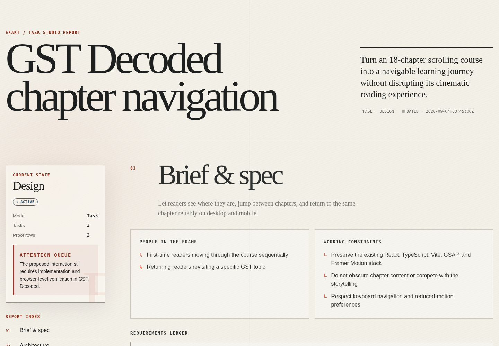

<div align="center">

# Exakt

**From intent to evidence.**

A portable engineering workflow that gives coding agents a clear contract,
a reviewable plan, and an honest standard for calling the work complete.

[Quick start](#quick-start) · [See the output](#see-what-exakt-produces) ·
[Read the example contract](#a-glimpse-of-the-engineering-contract) ·
[Use it well](#use-exakt-well)

</div>

---

Most coding agents can produce code. The difficult part is keeping the original
intent, repository reality, architecture, implementation, and final claims
aligned across a real project.

Exakt adds that missing engineering loop to Codex, Claude Code, and compatible
Agent Skills harnesses. Give it a bounded task or an entire product brief. It
inspects the actual repository, turns the request into an explicit engineering
contract, collaborates on decisions that matter, implements the approved scope,
and checks the result against observable acceptance criteria.

It stays inside the harness you already use. No new IDE, hosted dashboard, or
separate project-management ritual.

```text
intent → inspect → specify → design → approve → build → verify → explain
```

## Quick start

Install with the open Agent Skills CLI:

```sh
npx skills add charles161/exakt
```

Then invoke it naturally in your coding harness:

```text
# Codex
$exakt Add shareable chapter navigation without breaking browser history.

# Claude Code
/exakt Build the product described in product-brief.md.
```

Exakt selects the depth automatically:

- **Task mode** keeps a focused bug, feature, migration, or investigation
  compact.
- **Product mode** expands a PRD or broad outcome into users, boundaries,
  requirements, architecture, risks, acceptance criteria, and staged delivery.

## One command, one visible loop

Exakt does not begin by translating the prompt directly into code. It first
inspects the repository, states its current interpretation, and separates what
is known, assumed, decided, unknown, or conflicted. If one answer would
materially change the product or architecture, it asks one question with its
best guess instead of opening a long discovery interview.

After each answer, the change is explicit:

```text
Changed: deep links are part of the compatibility contract, not a redesign.
Still open: whether explicit chapter jumps should create browser history entries.
```

Once the contract is coherent, Exakt shows a short brief, asks for the relevant
execution approval, and maps stable milestones into the harness's native plan
or TODO view when that can be done without replacing unrelated work. The same
milestone IDs survive implementation, interruption, review, and closeout.

## See what Exakt produces

Every run maintains three local artifacts:

- `.exakt/spec.md` — the living, human-readable contract: intent, boundaries,
  architecture, behaviors, invariants, acceptance criteria, and proof plan.
- `.exakt/exakt-state.json` — the structured source of truth for the brief,
  stable IDs, decisions, tasks, evidence, invalidations, and gaps.
- `.exakt/exakt-report.html` — a responsive, self-contained report that works
  offline and can be reviewed outside the terminal. It is a projection of the
  same state, not a second source of truth.

The report has seven focused views: brief and specification, architecture,
acceptance criteria and plan, critique and decisions, progress, verification,
and files and evidence.

[](examples/gst-decoded-navigation.html)

This example analyzes chapter navigation for an existing 18-chapter React
learning product. [Inspect its structured state](examples/gst-decoded-navigation.json)
or [download the self-contained HTML report](examples/gst-decoded-navigation.html).

The terminal handoff stays deliberately small:

```text
EXAKT  •  TASK  •  DESIGN  •  ACTIVE
Project GST Decoded chapter navigation
Proof   0/4 acceptance criteria verified
State   /path/to/project/.exakt/exakt-state.json
```

Before execution, its conversational brief fits on one screen:

```text
Building: shareable chapter navigation without breaking continuous reading
Why: readers can return to and share a specific lesson
Boundary: no route-per-chapter rewrite or visual redesign
Architecture: one URL/viewport controller used by both navigation surfaces
Proof: deep-link, history, keyboard, reduced-motion, and 390px browser checks
Plan: 3 milestones / 6 tasks
Open: explicit jumps should push history; passive scrolling should replace it
Spec: .exakt/spec.md
```

The status says `ACTIVE`, not `VERIFIED`, because the example is a reviewed
design contract and no implementation was performed. Exakt keeps that gap
visible instead of turning a convincing plan into a false completion claim.

## A glimpse of the engineering contract

For this source brief:

```text
$exakt Add shareable navigation to an 18-chapter scrolling course. Preserve
the cinematic reading experience, support desktop and mobile, and do not break
keyboard navigation, reduced motion, deep links, or browser back/forward.
```

Exakt inspected the repository and produced a contract like this:

**Outcome**

Readers can see where they are, jump between chapters, and return to the same
chapter reliably on desktop and mobile.

**Architecture**

Keep the existing chapter metadata as the source of truth. Add one navigation
controller that reconciles viewport state with the URL, then let the desktop
rail and mobile sheet consume that controller instead of maintaining competing
state.

**Material decisions**

- Use `history.replaceState` for passive scrolling so the browser history is
  not flooded; use `pushState` only for an explicit chapter jump.
- Fall back safely when a URL contains an invalid chapter.
- Treat motion as decoration: navigation must remain correct when reduced
  motion is enabled.

**Observable acceptance criteria**

- Opening a valid deep link scrolls to that chapter and marks it active.
- Scrolling across chapter boundaries updates the URL without filling browser
  history with passive changes.
- Every control is keyboard reachable, visibly focused, and properly labelled.
- At `390px`, the page has no horizontal overflow and the closed picker does
  not cover the reading experience.

**Plan with proof attached**

1. Unify URL and viewport state; prove initial, invalid, passive-scroll, and
   explicit-jump behavior with focused tests.
2. Build the responsive navigation surfaces; verify them with keyboard and
   browser checks at desktop and mobile widths.
3. Run a fresh adversarial pass over reload, back/forward, rapid jumps, reduced
   motion, and invalid deep links.

That is the core difference: the output is not a generic checklist. It records
what the repository already proves, what is only proposed, why the architecture
was chosen, and exactly what evidence would make each claim true.

## Build and verification discipline

For executable behavior, Exakt defines the behavior, invariant, observable
oracle, and a concrete counterexample before implementation. Then it requires:

1. **RED:** a meaningful test fails against the pre-change behavior for the
   expected reason.
2. **GREEN:** the smallest coherent production change passes the focused check
   and relevant regression checks.
3. **REFACTOR:** structure improves without changing the protected behavior.
4. **Falsify:** a fresh negative, boundary, runtime, or separated review tries
   to disprove the result.

The closeout also inspects the production and test diff for weakened assertions,
skipped tests, fixture hard-coding, test-only branches, or snapshots changed
without semantic review. A green suite does not override those failures.

Documentation, visual work, and other non-executable changes use the honest
equivalent: record the before-state, name a defect or counterexample, change the
artifact, and inspect fresh proof. Exakt never invents a unit test for prose just
to make the workflow look rigorous.

Each milestone ends with a compact evidence record:

```text
Milestone: M2 — URL and viewport state agree
Completed: valid and invalid deep links, passive scroll, explicit jumps
Covered: R2, B1, INV1, AC1, AC2
Changed: src/navigation.ts, tests/navigation.test.ts
Proved: E4 focused RED/GREEN; E5 regression; E6 browser back/forward
Gaps: none
Commit: prepared; awaiting authorization
Status: verified
```

If commits are authorized, the milestone commit carries the same contract:

```text
feat(navigation): synchronize chapters with the URL

Milestone: M2
Implements: R2, B1
Protects: INV1
Accepts: AC1, AC2
Evidence: E4, E5, E6
Spec-Digest: sha256:<approved-contract-digest>
Gaps: none
```

The commit records provenance. The linked evidence—not the commit message—is
what supports the claim.

## Use Exakt well

You can invoke Exakt with one sentence. For better results on consequential
work, give it five pieces of signal:

```text
$exakt <outcome>

Users: who needs this and what must become easier?
Context: where should the agent look first?
Constraints: what must remain true?
Non-goals: what is deliberately outside this change?
Proof: what evidence should count as done?
```

For example:

```text
$exakt Add shareable chapter URLs to this course.

Users: readers returning to a specific lesson.
Context: chapter metadata and scroll state already exist under src/.
Constraints: preserve continuous scrolling, keyboard access, and reduced motion.
Non-goals: no route-per-chapter rewrite and no visual redesign.
Proof: focused state tests plus browser checks for deep links, history, and 390px.
```

To get the most from the workflow:

- Lead with the user-visible outcome. Do not pre-design the solution unless a
  technical choice is genuinely fixed.
- State hard constraints and non-goals. These prevent an impressive but wrong
  expansion of scope.
- Name the evidence bar. Tests, browser behavior, performance budgets, migration
  drills, or external state each prove different claims.
- Attach the real PRD for larger products. Exakt will decompose it and pause on
  decisions that materially change behavior, risk, or architecture.
- Keep the `.exakt/` artifacts. A later invocation can merge progress by stable
  milestone and task IDs instead of rebuilding context or renumbering work.
- Review the HTML report when decisions are dense. Its feedback control copies
  a structured response that can be pasted directly into the next harness turn.

## What Exakt will not pretend

Exakt does not treat generated code, a successful command, or an agent's own
summary as proof that the intended product exists. Its minimum completion gate
allows `verified` only when the work is at handoff, every acceptance criterion
and verification check is verified, and no declared gap remains.

External, destructive, costly, security-sensitive, and production actions
still require the host harness to obtain explicit approval for the exact action.

## Installation options

Install globally for one or both supported harnesses without prompts:

```sh
npx skills add charles161/exakt --skill exakt -g -a codex claude-code -y
```

For a manual or isolated installation:

```sh
git clone https://github.com/charles161/exakt.git
cd exakt

python3 skills/exakt/scripts/install.py --host codex
python3 skills/exakt/scripts/install.py --host claude
```

Use `--root <path>` for a generic target. The installer refuses to overwrite an
existing skill.

## Local report CLI

The bundled helper can initialize, summarize, render, and gate report state:

```sh
python3 skills/exakt/scripts/exakt.py init "Add shareable chapter navigation" --mode task
python3 skills/exakt/scripts/exakt.py status .exakt/exakt-state.json
python3 skills/exakt/scripts/exakt.py spec .exakt/exakt-state.json --force
python3 skills/exakt/scripts/exakt.py render .exakt/exakt-state.json --force
python3 skills/exakt/scripts/exakt.py verify .exakt/exakt-state.json
```

See [`docs/design.md`](docs/design.md) for the runtime boundary, durable state,
evidence model, and safety design.

## Develop and verify

Run the complete package suite from the repository root:

```sh
python3 -m unittest discover -s tests -v
```

The suite covers package surfaces, schemas, canonical state, journal replay,
approval binding, external-action recovery, the CLI, and deterministic report
rendering.
